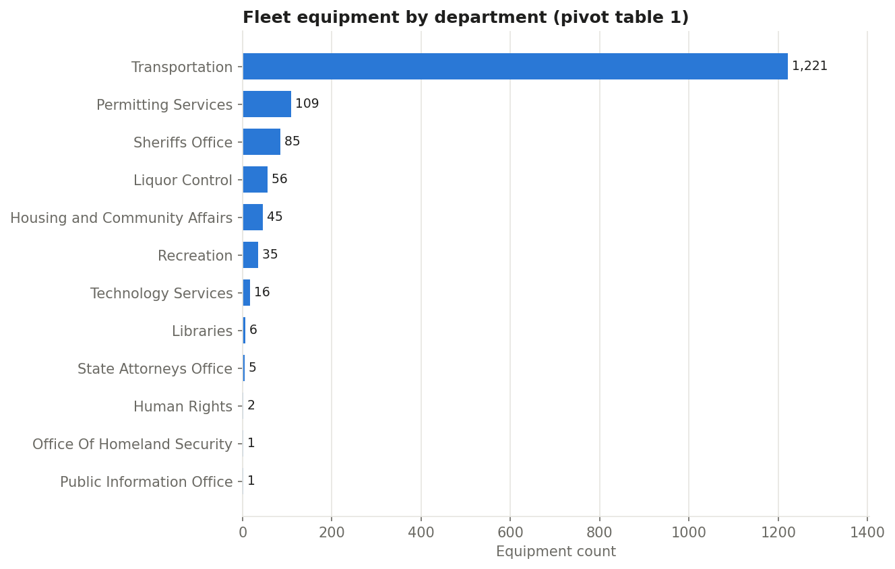
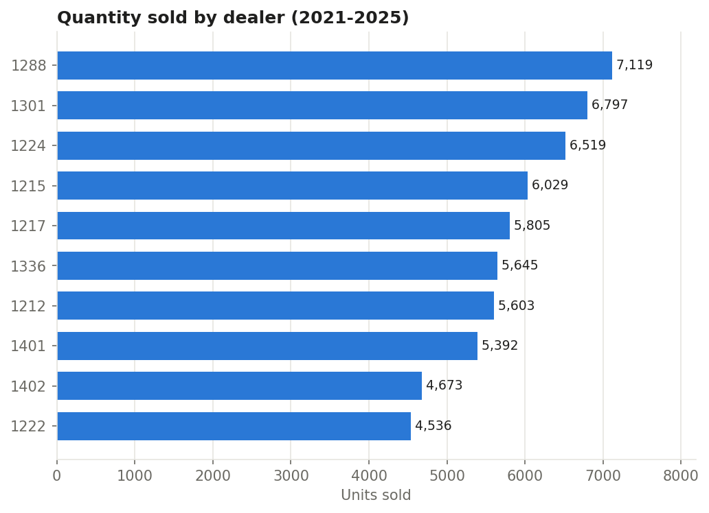
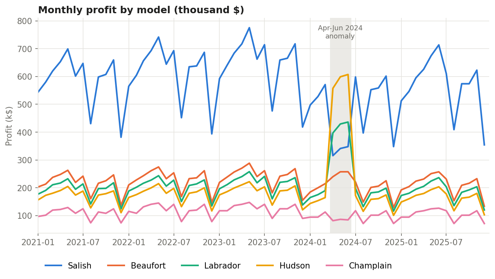
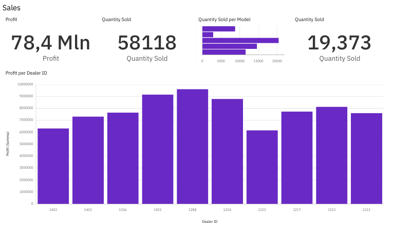
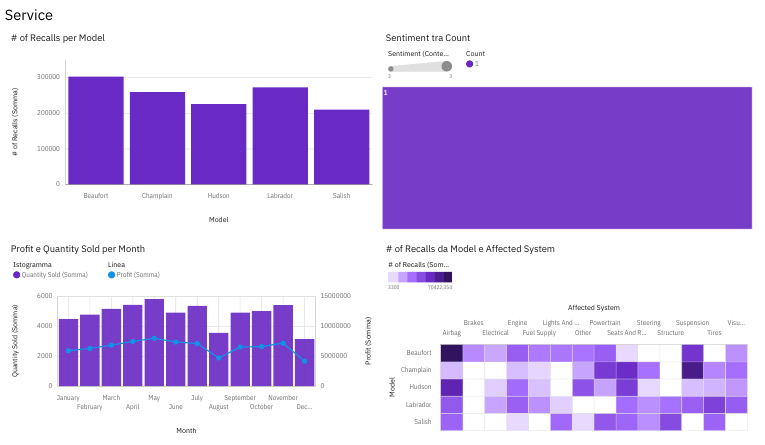

# Data Visualization & Dashboards with Excel and IBM Cognos Analytics


Final assignment of **Course 7 – *Data Visualization and Dashboards with Excel and Cognos***, part of the
**[IBM Data Analyst Professional Certificate](https://www.coursera.org/professional-certificates/ibm-data-analyst)** (Coursera).

The project covers the whole "raw data → clean table → pivot → chart → dashboard" workflow:

| Section | Dataset | Tools | Output |
|---|---|---|---|
| **Part 1 – Montgomery County fleet** | 102 rows · department / equipment class / count | Excel cleaning tools, formulas, pivot tables | Clean dataset, summary statistics, 3 pivot tables |
| **Part 2 – Car sales pivot charts** | 3,000 rows · monthly sales 2021-2025, 5 models, 10 dealers | Excel pivot tables & pivot charts | 4 pivot charts |
| **Part 3 – Car sales & service dashboard** | Car sales + vehicle recalls / service data | IBM Cognos Analytics | 2-tab dashboard (Sales, Service) |

---

## Table of contents

1. [Repository structure](#repository-structure)
2. [Part 1 – Montgomery County fleet inventory](#part-1--montgomery-county-fleet-inventory-excel-data-preparation--pivot-tables)
3. [Part 2 – Car sales pivot charts (Excel)](#part-2--car-sales-pivot-charts-excel)
4. [Part 3 – Car Sales and Service Dashboard (IBM Cognos Analytics)](#part-3--car-sales-and-service-dashboard-ibm-cognos-analytics)
5. [Key insights](#key-insights)
6. [Skills demonstrated](#skills-demonstrated)
7. [How to reproduce the preview charts](#how-to-reproduce-the-preview-charts)
8. [About the author](#about-the-author)
9. [License](#license)

---

## Repository structure

```
ibm-excel-cognos-dashboards/
├── data/
│   ├── CarSalesByModelEnd.xlsx                                 # Part 2 – car sales data + 4 pivot tables / pivot charts
│   ├── Montgomery_Fleet_Equipment_Inventory_FA.xlsx           # Part 1a – cleaned fleet inventory
│   └── Montgomery_Fleet_Equipment_Inventory_FA_PART_2_END.xlsx # Part 1b – table, formulas, 3 pivot tables
├── dashboard/
│   └── Car_Sales_and_Service_Dashboard.pdf                     # Part 3 – Cognos Analytics dashboard export
├── images/                                                     # Screenshots and preview charts used in this README
├── scripts/
│   └── make_charts.py                                          # Re-draws some Excel views as PNG for GitHub preview
├── requirements.txt
├── LICENSE
└── README.md
```

> The Excel workbooks are the actual deliverables of the assignment (pivot tables and pivot charts are
> inside the files – open them in Excel to explore them interactively). Sheet and field names such as
> *Somma di*, *Totale complessivo* and *Tabella1* come from the Italian locale of Excel used to build them.

---

## Part 1 – Montgomery County fleet inventory (Excel data preparation & pivot tables)

**Data:** equipment inventory of Montgomery County (Maryland) departments – for each department, the
number of vehicles/equipment in each class (Sedan, SUV, Pick Up Trucks, Transit Bus, Heavy Duty, …).
The assignment uses two halves of the inventory: departments *Board of Elections* → *Health and Human Services*
(53 rows) and *Housing and Community Affairs* → *Transportation* (49 rows).

### 1a – Data cleaning (`Montgomery_Fleet_Equipment_Inventory_FA.xlsx`)

Starting from the raw CSV export, I prepared the data for analysis:

1. **Converted the CSV to an Excel workbook (.xlsx)** and adjusted column widths for readability.
2. **Removed empty rows** using filters.
3. **Removed duplicate records** (*Data → Remove Duplicates*), keeping **53 unique rows**.
4. **Fixed spelling errors** with the spell checker.
5. **Normalized whitespace** with *Find & Replace* (double spaces → single space).
6. **Combined the split Department fields** into a single column with **Flash Fill**.

Result: a clean table of 53 records (13 departments, 531 units) with no blanks, duplicates or double spaces.

### 1b – Summary statistics and pivot tables (`Montgomery_Fleet_Equipment_Inventory_FA_PART_2_END.xlsx`)

1. **Converted the range into an Excel Table** (`Tabella1`, style *Medium 15*) to get structured references,
   banded rows and filters.
2. **Descriptive statistics with formulas** on the *Equipment Count* column:

   | Function | Formula | Result |
   |---|---|---|
   | SUM | `=SUM(Tabella1[Equipment Count])` | **1,582** |
   | MIN | `=MIN(C2:C50)` | 1 |
   | MAX | `=MAX(C2:C50)` | 379 |
   | COUNT | `=COUNT(C2:C50)` | 49 |
   | AVERAGE | `=AVERAGE(C2:C50)` | 32.29 |

3. **Three pivot tables** to summarise the fleet from different angles:
   - **Pivot Table 1** – total equipment per department, sorted descending.
   - **Pivot Table 2** – department → equipment class drill-down (Transportation expanded).
   - **Pivot Table 3** – equipment class → department drill-down (CUV expanded).



**Findings**

- **Transportation owns 1,221 of 1,582 units (≈ 77%)** of this part of the fleet – mainly Transit Buses (379),
  Off Road Vehicle Equipment (276) and Heavy Duty vehicles (248).
- By class, **Transit Bus (379)**, **Heavy Duty (290)** and **Off Road Vehicle Equipment (283)** are the largest
  groups; almost all *Public Safety* vehicles (79 of 80) belong to the Sheriff's Office.
- The distribution is highly skewed (mean 32 vs max 379), so medians/pivots are more informative than the average.

---

## Part 2 – Car sales pivot charts (Excel)

**Data:** `Sales by Model` sheet – 3,000 records (600 per year, **Jan 2021 → Dec 2025**) with
`Year, Month, Date, Model, Dealer ID, Quantity Sold, Profit` for **5 car models** (Beaufort, Champlain,
Hudson, Labrador, Salish) sold by **10 dealers**.

I built four pivot tables, each with its own pivot chart:

| Sheet | Pivot table | Chart |
|---|---|---|
| `Quantity Sold by Dealer` | Sum of Quantity Sold by Dealer ID (sorted) | Clustered bar chart |
| `Profit by Date and Model` | Sum of Profit by Date (rows) × Model (columns) | Line chart |
| `Profit by Year and Dealer ID` | Sum of Profit by Year (rows) × Dealer ID (columns) | Stacked column chart |
| `Hudson Profit by Dealer` | Sum of Profit by Dealer ID, **filtered on Model = Hudson** | Line chart |

Preview (re-drawn with Python from the same data – see [`scripts/make_charts.py`](scripts/make_charts.py)):





**Findings**

- **Total profit: $78.4 M** on **58,118 units** sold over five years.
- **Dealer 1288** is the top performer both in units (7,119) and profit ($9.60 M), followed by 1301 and 1224;
  dealers **1222** and **1402** are at the bottom (≈ $6.2–6.3 M).
- Profit grew from $15.3 M (2021) to a **peak of $16.9 M in 2023**, then declined in 2024 ($15.2 M) and 2025 ($14.8 M).
- Clear **seasonality**: May is the strongest month, while **August and December** are consistently the weakest.
- **Data-quality anomaly:** in **April–June 2024** the profit of Hudson and Labrador jumps to 2–3× their usual level
  while Salish drops by half, even though quantities stay normal – a pattern that looks like values swapped between
  models. The line chart makes this immediately visible. January 2024 also contains daily records
  (1–15 Jan) instead of a single monthly record.

---

## Part 3 – Car Sales and Service Dashboard (IBM Cognos Analytics)

Interactive dashboard built in **IBM Cognos Analytics** with two tabs. The full export is in
[`dashboard/Car_Sales_and_Service_Dashboard.pdf`](dashboard/Car_Sales_and_Service_Dashboard.pdf).

### Sales tab



| Visualization | Type | What it shows |
|---|---|---|
| Profit | KPI | Total profit: **78.4 M** |
| Quantity Sold | KPI | Total units sold: **58,118** |
| Quantity Sold per Model | Bar chart | Units by model – Hudson leads with 20,365 |
| Quantity Sold | KPI | Average units per sales record: **19.37** |
| Profit per Dealer ID | Column chart | Profit by each of the 10 dealers |

### Service tab



| Visualization | Type | What it shows |
|---|---|---|
| # of Recalls per Model | Column chart | Recall volume by model – Beaufort has the most, Salish the fewest |
| Sentiment by Count | Treemap | Distribution of customer sentiment in service feedback |
| Profit and Quantity Sold per Month | Combo chart (columns + line) | Seasonality of units and profit across months |
| # of Recalls by Model and Affected System | Heat map | Which vehicle systems (airbag, brakes, powertrain, …) drive recalls for each model |

---

## Key insights

1. **Salish is the profit engine:** only 19.9% of units but **44.2% of total profit** (≈ $3,000 per unit),
   while **Hudson** is the volume leader (35% of units) with the lowest profit per unit (≈ $565).
2. **Dealer performance is uneven:** the best dealer (1288) earns ≈ 56% more profit than the weakest (1222) –
   a good starting point for sharing best practices across the network.
3. **Seasonality matters for planning:** the May peak and the August/December troughs repeat every year,
   useful for inventory and staffing decisions.
4. **Quality issues are model-specific:** Beaufort has the highest recall volume and Salish the lowest, and the
   heat map shows that recalls concentrate in a few model × affected-system combinations rather than being spread evenly.
5. **Always validate the data:** the April–June 2024 profit spike would distort any trend analysis and should
   be verified with the data owner before drawing conclusions.

---

## Skills demonstrated

- **Excel data preparation:** CSV import, removing blanks and duplicates, spell check, Find & Replace, Flash Fill.
- **Excel analysis:** Tables and structured references, aggregate functions (SUM, MIN, MAX, COUNT, AVERAGE),
  pivot tables (multi-level rows, columns, report filters, sorting), pivot charts (bar, column, stacked column, line).
- **IBM Cognos Analytics:** data upload and modelling, KPI tiles, bar/column/combo charts, treemap, heat map,
  multi-tab dashboard layout and export.
- **Data storytelling:** choosing the right chart for each question and turning charts into business insights.
- **Data quality awareness:** spotting anomalies and inconsistent granularity through visualization.

---

## How to reproduce the preview charts

The analysis itself was done in Excel and Cognos; the Python script only regenerates the PNG previews in `images/`.

```bash
git clone https://github.com/v-ambrosino/ibm-excel-cognos-dashboards.git
cd ibm-excel-cognos-dashboards
pip install -r requirements.txt
python scripts/make_charts.py
```

---

## About the author

**Vincenzo Ambrosino** – former IT lab teacher transitioning into Data Analytics.

- GitHub: [@v-ambrosino](https://github.com/v-ambrosino)
- LinkedIn: [vincenzo-ambrosino](https://www.linkedin.com/in/vincenzo-ambrosino)

## Acknowledgements

Datasets and assignment brief provided by **IBM Skills Network** as part of the IBM Data Analyst Professional
Certificate. The Montgomery County fleet data is derived from Montgomery County (MD) open data.

## License

This project is released under the [MIT License](LICENSE).
